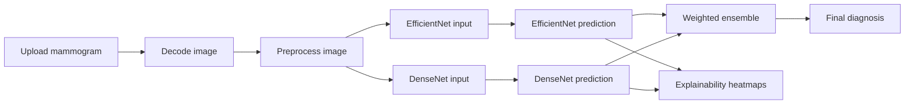

# Mammogram App

An interactive Streamlit application for mammogram analysis using a weighted ensemble of two deep-learning models:

- EfficientNet for shape-aware classification
- DenseNet for texture-aware classification

The app processes an uploaded mammogram, cleans and standardizes the image, runs both models, combines their predictions, and optionally shows explainability overlays with Grad-CAM or Score-CAM.

## What this project does

This project helps visualize a breast image classification workflow in a compact and user-friendly way. It is designed to show how a clinical AI pipeline can be assembled from preprocessing, inference, and explainability components.

Main output classes:

- BI-RADS 1 (Normal)
- BI-RADS 3 (Benign)
- BI-RADS 4 (Suspicious)
- BI-RADS 5 (Malignant)

## Features

- Upload a mammogram image through a simple web interface
- Preprocess the image with breast ROI cropping, CLAHE contrast enhancement, and aspect-ratio preserving resize
- Run two separate neural networks on the same image
- Combine model predictions with a weighted ensemble
- Display confidence charts for each model and the final decision
- Generate heatmaps with Grad-CAM or Score-CAM for visual explanation

## How it works



### Preprocessing pipeline

The image is standardized before prediction so both models receive a consistent input.

1. Convert the image to grayscale for tissue detection.
2. Crop the breast region of interest by finding the largest contour.
3. Apply CLAHE to improve local contrast.
4. Convert the image back to RGB because the models expect three channels.
5. Resize with padding to 224 x 224 without stretching the anatomy.

### Prediction pipeline

The application uses two model views of the same scan:

- EfficientNet focuses more on global shape patterns.
- DenseNet focuses more on texture and local appearance.

Their outputs are merged with a weighted ensemble:

```text
final_prediction = 0.7 * efficientnet_prediction + 0.3 * densenet_prediction
```

The class with the highest final score becomes the displayed diagnosis.

### Explainability

If explainability is enabled, the app tries to find a suitable convolutional layer automatically and then creates a heatmap:

- Grad-CAM highlights areas that strongly influenced the prediction gradient
- Score-CAM estimates channel importance using forward passes

The heatmap is overlaid on the original mammogram to show which regions contributed most to the model decision.

## Project structure

- [app.py](app.py) - Main Streamlit application, model loading, inference, charts, and XAI views
- [preprocessing.py](preprocessing.py) - Breast cropping and image resizing utilities
- [best_mammogram_model_phase2_final.keras](best_mammogram_model_phase2_final.keras) - EfficientNet-based model
- [best_densenet_model.keras](best_densenet_model.keras) - DenseNet-based model
- [requirements.txt](requirements.txt) - Python dependencies

## Simple engineering view

This app follows a straightforward layered design:

- UI layer: Streamlit handles upload, layout, status messages, and result display
- Preprocessing layer: OpenCV and NumPy prepare the image for inference
- Model layer: TensorFlow loads the saved Keras models and produces predictions
- Decision layer: a fixed weighted average combines both model outputs
- Visualization layer: Plotly and heatmap overlays make results easier to interpret

That structure keeps the app easy to understand and easy to extend. For example, you can swap the models, adjust the ensemble weights, or replace the preprocessing logic without rewriting the whole app.

## Setup

### 1. Create a virtual environment

```bash
python -m venv .venv
.venv\Scripts\activate
```

### 2. Install dependencies

```bash
pip install -r requirements.txt
```

### 3. Run the app

```bash
streamlit run app.py
```

## Notes

- The models must be present in the project root with the exact filenames used in the code.
- The current upload flow is built around image files that OpenCV can decode.
- If you add new model files or change the class order, update the constants in [app.py](app.py).

## Engineering notes

- The app uses `st.cache_resource` to avoid reloading models on every interaction.
- The preprocessing step is shared by both models so the ensemble sees the same cleaned image.
- The app uses separate preprocessing functions for EfficientNet and DenseNet because those architectures expect different input scaling.
- The XAI layer is optional, so the main prediction path remains fast even when explainability is disabled.

## Future improvements

- Add explicit upload validation for unsupported file types
- Add a batch inference mode for multiple scans
- Save prediction results to a report or CSV file
- Add patient-level metadata fields if needed for research workflows
- Add a clearer fallback for cases where Score-CAM is too slow

